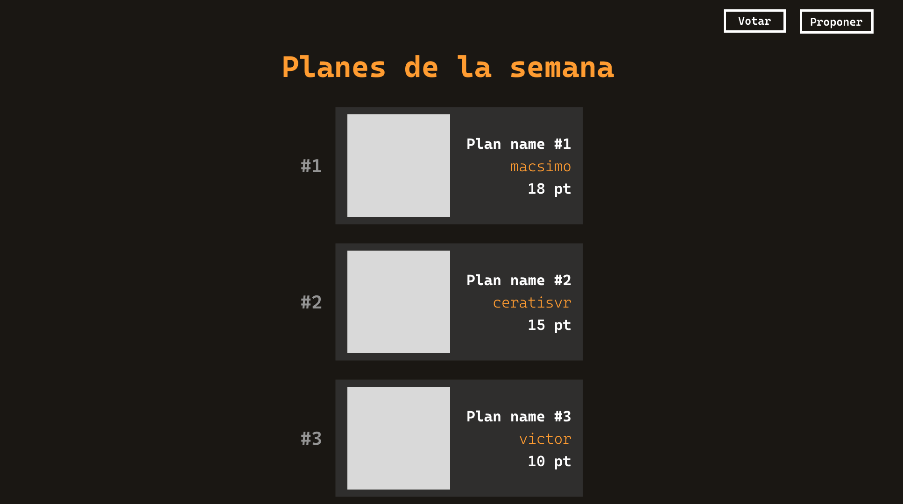

# Votame!


Una app para proponer, votar y rankear ideas para planes de la semana.

## 📸 Screenshots



## 🚀 Pre-requisitos

* Bun

    git clone [https://github.com/nahumsvr/votame](https://github.com/nahumsvr/votame)
    ```
2.  Instala las dependencias:
    ```bash
    bun install
    

## 💻 Cómo usar

Para correr el servidor de desarrollo:

```bash
bun dev